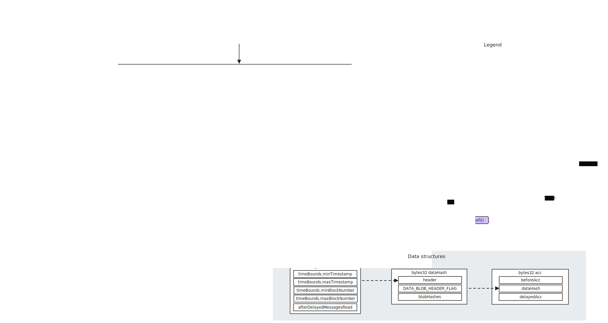

# Orbit stack

<!-- START doctoc generated TOC please keep comment here to allow auto update -->
<!-- DON'T EDIT THIS SECTION, INSTEAD RE-RUN doctoc TO UPDATE -->
**Table of Contents**

- [Sequencing](#sequencing)
  - [Where are these inputs used?](#where-are-these-inputs-used)
  - [Batch spending report](#batch-spending-report)
- [Proving](#proving)

<!-- END doctoc generated TOC please keep comment here to allow auto update -->


## Sequencing

<figure>
    
    <figcaption>Arbitrum sequencing data flow.</figcaption>
</figure>

The main function used to sequence blobs in the orbit stack is the `addSequencerFromBlobsImpl` function, whose interface is as follows:

```solidity
function addSequencerL2BatchFromBlobsImpl(
    uint256 sequenceNumber,
    uint256 afterDelayedMessagesRead,
    uint256 prevMessageCount,
    uint256 newMessageCount
) internal {
```

Example of calls:
1. Block: `22866981` ([link](https://etherscan.io/tx/0xaad2f94ba2ae05095f86bb7cf1a86cb0bac4cf17c3eeb4503513a3228ab19ecc))
   - `sequenceNumber`: `934316`
   - `afterDelayedMessagesRead`: `2032069`
   - `prevMessageCount`: `332968910`
   - `newMessageCount`: `332969371` (`+461`)

2. Block: `22866990` (`+9`) ([link](https://etherscan.io/tx/0x9dfc4151dbf46522e53a984e4c48939fd4eb77fb0abc489571e7f9753f0a2227))
    - `sequenceNumber`: `934317` (`+1`)
    - `afterDelayedMessagesRead`: `2032073` (`+4`)
    - `prevMessageCount`: `332969371` (`+0`) 
    - `newMessageCount`: `332969899` (`+528`)

3. Block: `22867001` (`+11`) ([link](https://etherscan.io/tx/0x9245bd5da3892fe9f263750042536dac156ef71a328079f5e7eec01689d35f81))
    - `sequenceNumber`: `934318` (`+1`)
    - `afterDelayedMessagesRead`: `2032073` (`+0`)
    - `prevMessageCount`: `332969899` (`+0`) 
    - `newMessageCount`: `332970398` (`+499`)

It's important to note that when a batch is submitted, also a "batch spending report" is submitted with the purpose of reimbursing the batch poster on the L2. The function will be analyzed later on.

The `formBlobDataHash` function is called to prepare the data that is then saved in storage. Its interface is as follows:

```solidity
function formBlobDataHash(
    uint256 afterDelayedMessagesRead
) internal view virtual returns (bytes32, IBridge.TimeBounds memory, uint256)
```

First, the function fetches the blob hashes of the current transaction using a [Reader4844 yul contract](https://github.com/OffchainLabs/nitro-contracts/blob/0b8c04e8f5f66fe6678a4f53aa15f23da417260e/yul/Reader4844.yul#L4). Then it creates a "packed header" using the `packHeader` function, which is defined as follows:

```solidity
function packHeader(
    uint256 afterDelayedMessagesRead
) internal view returns (bytes memory, IBridge.TimeBounds memory) {
```

The function takes the rollup's bridge "time bounds" and computes the appropriate bounds given the `maxTimeVariation` values, the current timestamp and block number. Such values are then returned together with the `afterDelayedMessagesRead` value.

A time bounds struct is defined as follows:
```solidity
struct TimeBounds {
    uint64 minTimestamp;
    uint64 maxTimestamp;
    uint64 minBlockNumber;
    uint64 maxBlockNumber;
}
```

and the `maxTimeVariation` is a set of four values representing how much in the past or in the future the time or blocks can be from the current time and block number. This is done to prevent reorgs from invalidating sequencer preconfirmations, while also establishing some bounds.

For Arbitrum One, these values are set to:
- `delayBlocks`: `7200` blocks (24 hours at 12s block time)
- `futureBlocks`: `64` blocks (12.8 minutes at 12s block time)
- `delaySeconds`: `86400` seconds (24 hours)
- `futureSeconds`: `768` seconds (12.8 minutes)

The `formBlobDataHash` function then computes the blobs cost by taking the current blob base fee, the (fixed) amount of gas used per blob and the number of blobs. Right after, the following value is returned:
```solidity
return (
    keccak256(bytes.concat(header, DATA_BLOB_HEADER_FLAG, abi.encodePacked(dataHashes))),
    timeBounds,
    block.basefee > 0 ? blobCost / block.basefee : 0
);
```

Now that the `dataHash` is computed, the `addSequencerL2BatchImpl` function is called, which is defined as follows:

```solidity
function addSequencerL2BatchImpl(
    bytes32 dataHash,
    uint256 afterDelayedMessagesRead,
    uint256 calldataLengthPosted,
    uint256 prevMessageCount,
    uint256 newMessageCount
)
    internal
    returns (uint256 seqMessageIndex, bytes32 beforeAcc, bytes32 delayedAcc, bytes32 acc)
```

The function, after some checks, calls the `enqueueSequencerMessage` on the `Bridge` contract, passing the `dataHash`, `afterDelayedMessagesRead`, `prevMessageCount` and `newMessageCount` values.

The `enqueueSequencerMessage` function is defined as follows:

```solidity
function enqueueSequencerMessage(
    bytes32 dataHash,
    uint256 afterDelayedMessagesRead,
    uint256 prevMessageCount,
    uint256 newMessageCount
)
    external
    onlySequencerInbox
    returns (uint256 seqMessageIndex, bytes32 beforeAcc, bytes32 delayedAcc, bytes32 acc)
```

The function, after some checks, fetches the previous "accumulated" hash and merges it with the new `dataHash` and the "delayed inbox" accumulated hash given the current `afterDelayedMessagesRead`. This new hash is then pushed in the `sequencerInboxAccs` array, which represents the canonical list of inputs to the rollup state transition function.

### Where are these inputs used?

- When creating a new assertion, to ensure that the caller is creating an assertion on the expected inputs;
- When "fast confirming" assertions (in the context of AnyTrust);
- When validating the inputs in the last step of a fraud proof, specifically inside the `OneStepProverHostIo` contract.

### Batch spending report

TODO

## Proving

State roots are proved using an optimistic proof system involving an interactive bisection protocol and a final onchain one-step execution. In particular, a bisection can conclude with a call to the `confirmEdgeByOneStepProof` function, which ultimately references the inputs that have been posted onchain.

The bisection protocol is divided into 3 "levels", depending on the size of the step: block level, big step level, and small step level. The interaction between these levels is non-trivial and also effects its economic guarantees.

A dedicated smart contract, the `OneStepProofEntry`, manages a set of sub-contracts depending on the type of step that needs to be executed onchain, and finally returns the post-execution state hash to the caller.

The `proveOneStep` function in `OneStepProofEntry` is defined as follows:

```solidity
function proveOneStep(
    ExecutionContext calldata execCtx,
    uint256 machineStep,
    bytes32 beforeHash,
    bytes calldata proof
) external view override returns (bytes32 afterHash)
```

The `ExecutionContext` struct is defined as follows:

```solidity
struct ExecutionContext {
    uint256 maxInboxMessagesRead;
    IBridge bridge;
    bytes32 initialWasmModuleRoot;
}
```

where the `maxInboxMessagesRead` is set to the `nextInboxPosition` of the previous assertion, which can be seen as the "inbox" target set by the previous assertion to the new assertion. This value should at least be one more than the inbox position covered by the previous assertion, and is set to the current sequencer message count for the next assertion. If an assertion reaches the maximum number of blocks allowed but doesn't reach the `nextInboxPosition`, it is considered an "overflow" assertion which has its own specific checks.

The `OneStepProofEntry` contract populates the machine value and frame stacks and registries given the `proof`. A machine hash is computed using these values and the `wasmModuleRoot`, which determines the program to execute. Instructions and necessary merkle proofs are deserialized from the proof. Based on the opcode to be executed onchain, a sub-contract is selected to actually execute the step. The ones that require referencing the inbox inputs are the ones that require calling the `OneStepProverHostIo` contract. An `Instruction` is simply defined as:

```solidity
struct Instruction {
    uint16 opcode;
    uint256 argumentData;
}
```

If the instruction is `READ_INBOX_MESSAGE`, the `executeReadInboxMessage` function is called, which either references the sequencer inbox or the delayed inbox, depending whether the argument is `INBOX_INDEX_SEQUENCER` or `INBOX_INDEX_DELAYED`. The functions compute the appropriate accumulated hash given its inputs, fetched from the `sequencerInboxAccs` or `delayedInboxAccs`, and checks that it matches the expected one.

The `executeReadPreImage` function is instead used to execute a "read" out of either a keccak256 preimage or a blob hash preimage, using the 4844 point evaluation precompile. It is made sure that the correct point is used for the evaluation.

## L1 to L2 messaging

Different types of messages can be sent from L1 to L2, and each of them is identified by a "kind" value, as follows:

```solidity
uint8 constant L2_MSG = 3;
uint8 constant L1MessageType_L2FundedByL1 = 7;
uint8 constant L1MessageType_submitRetryableTx = 9;
uint8 constant L1MessageType_ethDeposit = 12;
uint8 constant L1MessageType_batchPostingReport = 13;
uint8 constant L2MessageType_unsignedEOATx = 0;
uint8 constant L2MessageType_unsignedContractTx = 1;

uint8 constant ROLLUP_PROTOCOL_EVENT_TYPE = 8;
uint8 constant INITIALIZATION_MSG_TYPE = 11;
```

### Gas token deposit (ETH)

To deposit ETH on the L2 to be used as a gas token, the `depositEth` function on the `Inbox` contract (also called "delayed inbox") is used, which is defined as follows:

```solidity
function depositEth() public payable whenNotPaused onlyAllowed returns (uint256)
```

[Here](https://etherscan.io/tx/0x2c447ec2cb6343af140e25c441bcfdb1a67492540fc4074dcfa777c79324b8a4)'s an example transaction.

The `onlyAllowed` modifier checks an "allow list", if enabled. The control passes to the `_deliverMessage` function, which is defined as follows:

```solidity
function _deliverMessage(
    uint8 _kind,
    address _sender,
    bytes memory _messageData,
    uint256 amount
) internal returns (uint256)
```

The message kind used here is `L1MessageType_ethDeposit`. Ultimately, the `enqueueDelayedMessage` function is called on the `Bridge` contract. The function ultimately pushes an accumulated hash to the `delayedInboxAccs` array.

TODO

## Derivation

The derivation logic for Arbitrum and Orbit chains is defined in the [nitro](https://github.com/OffchainLabs/nitro) node.

The L1 node connection is done through the `L1Reader` in the `getL1Reader` function in `arbnode/node.go`. All necessary addresses are fetched from the `/cmd/chaininfo/arbitrum_chain_info.json` file. For example, here's the configuration for Arbitrum One:

```json
{
    "chain-name": "arb1",
    "parent-chain-id": 1,
    "parent-chain-is-arbitrum": false,
    "sequencer-url": "https://arb1-sequencer.arbitrum.io/rpc",
    "secondary-forwarding-target": "https://arb1-sequencer-fallback-1.arbitrum.io/rpc,https://arb1-sequencer-fallback-2.arbitrum.io/rpc,https://arb1-sequencer-fallback-3.arbitrum.io/rpc,https://arb1-sequencer-fallback-4.arbitrum.io/rpc,https://arb1-sequencer-fallback-5.arbitrum.io/rpc",
    "feed-url": "wss://arb1-feed.arbitrum.io/feed",
    "secondary-feed-url": "wss://arb1-delayed-feed.arbitrum.io/feed,wss://arb1-feed-fallback-1.arbitrum.io/feed,wss://arb1-feed-fallback-2.arbitrum.io/feed,wss://arb1-feed-fallback-3.arbitrum.io/feed,wss://arb1-feed-fallback-4.arbitrum.io/feed,wss://arb1-feed-fallback-5.arbitrum.io/feed",
    "has-genesis-state": true,
    "block-metadata-url": "https://arb1.arbitrum.io/rpc",
    "track-block-metadata-from": 327000000,
    "chain-config": {
      "chainId": 42161,
      "homesteadBlock": 0,
      "daoForkBlock": null,
      "daoForkSupport": true,
      "eip150Block": 0,
      "eip150Hash": "0x0000000000000000000000000000000000000000000000000000000000000000",
      "eip155Block": 0,
      "eip158Block": 0,
      "byzantiumBlock": 0,
      "constantinopleBlock": 0,
      "petersburgBlock": 0,
      "istanbulBlock": 0,
      "muirGlacierBlock": 0,
      "berlinBlock": 0,
      "londonBlock": 0,
      "clique": {
        "period": 0,
        "epoch": 0
      },
      "arbitrum": {
        "EnableArbOS": true,
        "AllowDebugPrecompiles": false,
        "DataAvailabilityCommittee": false,
        "InitialArbOSVersion": 6,
        "InitialChainOwner": "0xd345e41ae2cb00311956aa7109fc801ae8c81a52",
        "GenesisBlockNum": 0
      }
    },
    "rollup": {
      "bridge": "0x8315177ab297ba92a06054ce80a67ed4dbd7ed3a",
      "inbox": "0x4dbd4fc535ac27206064b68ffcf827b0a60bab3f",
      "rollup": "0x5ef0d09d1e6204141b4d37530808ed19f60fba35",
      "sequencer-inbox": "0x1c479675ad559dc151f6ec7ed3fbf8cee79582b6",
      "validator-utils": "0x9e40625f52829cf04bc4839f186d621ee33b0e67",
      "validator-wallet-creator": "0x960953f7c69cd2bc2322db9223a815c680ccc7ea",
      "stake-token": "0xC02aaA39b223FE8D0A0e5C4F27eAD9083C756Cc2",
      "deployed-at": 15411056
    }
}
```

Then an `InboxReader` is created using the `NewInboxReader` function in `arbnode/inbox_reader.go`, which, among other things, takes in input the L1 reader, the sequencer inbox address and the delayed inbox address.

Transaction data from the sequencer is fetched using the `LookupBatchesInRange` method on the `SequencerInbox` type, which returns a list of `SequencerInboxBatch` values.

Transaction data from the sequencer inbox is processed using the `getSequencerData` method on the `SequencerInboxBatch` type in `arbnode/sequencer_inbox.go`. The method is called in the `Serialize` method.

The `SequencerInboxBatch` type is defined as follows:

```go
type SequencerInboxBatch struct {
	BlockHash              common.Hash
	ParentChainBlockNumber uint64
	SequenceNumber         uint64
	BeforeInboxAcc         common.Hash
	AfterInboxAcc          common.Hash
	AfterDelayedAcc        common.Hash
	AfterDelayedCount      uint64
	TimeBounds             bridgegen.IBridgeTimeBounds
	RawLog                 types.Log
	DataLocation           BatchDataLocation
	BridgeAddress          common.Address
	Serialized             []byte // nil if serialization isn't cached yet
}
```
